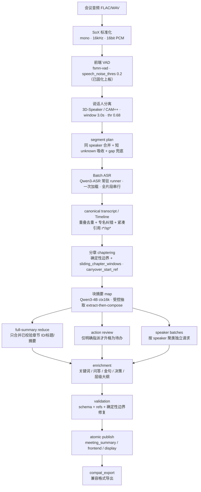

# 技术演进路线（RK1828 端侧会议纪要系统）

> 材料来源：`E:\工作记录\` 2026-07-28 ~ 2026-08-26 日报/周报/交接 + 板端全链路说明 + 后续（09 月）前端优化/评测/微调实验。
> 口径：所有数字与结论均来自真实记录；PC 侧实验为板端**等价替代**（Ollama/transformers/modelscope），方法论可信、绝对数值板端会有差异，文中标注。板端数字标「板端」。

---

## 0. 前身与定位

- **前身**：`HawlsonZ/Meeting_Agent`（RK1828 离线会议 Agent）——一条**只在板端跑的生产 Harness**：`音频 → SoX 标准化 → 3D-Speaker 分离 → segment plan → Qwen3-ASR Batch → canonical transcript → Qwen3-4B ctx16k → Python 校验归并 → 总结/导出`。**不含前端**，摘要固定 `sliding_chapter_windows`，Qwen3 thinking 与最终 JSON 分开保存。
- **现版（本仓库 meet）** 在其上增加：**Windows 前端 + Gateway 三层产品链路**、**评测体系**（golden_v2 + 标准转写评测线）、**前端 VAD 优化并固化上板**、**4B 微调实验**。
- **不变的内核**：认清 4B 小模型能力边界，用确定性流程搭骨架、模型只做强项（见 `CLAUDE.md`）。

---

## 全链路演进架构图（音频 → 纪要）

### 当前全链路（每步标注所用组件）

> 骨架是**确定性 DAG**（标准化/VAD/分离/切分/去重/分章边界/范围归并/校验发布），4B 只在 map/reduce/speaker/action 四类节点做「受控抽取/判断」——这是围绕 4B 能力边界的总设计（`CLAUDE.md`）。

### 每步方案的演进（v0 → 当前，附定夺原因）

**① 音频标准化**：始终 SoX → mono/16kHz/16bit PCM（未变）。

**② 前端 VAD**：默认 `speech_noise_thres=0.6` → **0.2（板端固化）**。原因：逐句对齐证明 ~20%（板端 g1 28%）实义整句被判静音、丢核心事实；矩阵+杂质双验证后整句丢 28%→9%、端到端 CER 0.56→0.44。

**③ 说话人分离**：窗口 10s（混人）/1.5s（过切 14 类）→ **3.0s / thr 0.68**（9 组对比）；RTTM padding/merge → 短 unknown 吸收 → gap `speaker=unknown` 兜底。板端聚类合格（人数准/纯度 0.93/混淆 0.02），瓶颈在前端 VAD 非聚类。

**④ ASR**：**SenseVoice（板端 RKNN 出不了正确结果，定位到导出/算子）→ Qwen3-ASR**；切片 155→95→**87 chunk（ASR unit + bridge）**；**逐 chunk 重启 → 常驻 Batch runner（一次加载、清 KV、串行全片段）= 8.91× 加速**；热词偏置 PC 验证 GO（B-WER 0.186→0.083）板端 C++ 待落。

**⑤ 转写规范化/后处理**：canonical segments（稳定 `seg-*` ID + 毫秒时间）+ 可读 `timeline.txt`；**重叠去重（确定性无损）**；**专名纠错两段式（85%→97%，4B 调用 166→6）**；LLM 输入用**紧凑引用 `[r38][时间][sp3]`**（减轻弱模型处理长 ID），校验后展开回 canonical ID。

**⑥ 分章 chaptering**（重点演进）：

| 版本 | 方式 | 结果 / 定夺 |
|---|---|---|
| v0 一次性全量 | Timeline 塞得下就一次出 title/overview/chapters/… | 4B 多任务复合、长会崩 → 弃 |
| v1 模型自吐边界（temperature=0 滑窗） | 让模型自己定切点 | **欠切 4 章（尾章吞 53%）↔ 调参过切 26 章，随参数剧烈摆动、不可复现** → 把边界判断移出模型 |
| v2 确定性 A 层 `seg.v2` | 算法按 speaker/gap/size 切，4B 只摘块 | 稳定 7-8 章、可复现；但边界切在长 Q&A 中间，Pk 0.497（比旧 4 章还差）→ 需要真话题信号 |
| v3 话语标记 `discourse_segmenter` | 正则+轮次（学员提问/主持人邀请下一位/收尾） | 边界召回 2/10→7/10，**Pk 0.497→0.190**（单场，cue 待泛化） |
| v3′ embedding 细切 + 4B 二次合并 | bge 句向量谷深度细切 → 4B 判同议题合并 | 命中飞书 82%/阿里 77%；追阿里粗档难（embedding 擅细粒度漂移、不擅粗粒度归组） |
| 板端主线 `sliding_chapter_windows` | 按 canonical segment 构章节窗口 + `carryover_start_ref` 推进 + 确定性范围归并（重叠截断/同起点合并/反向归一） | 30 场板端验证；LLM 只判语义核心范围 `core_start/end_ref`，最终连续范围与时间回填由程序保证 |

**⑦ 摘要 summarization**（重点演进）：

| 版本 | 方式 | 说明 / 定夺 |
|---|---|---|
| v0 一次性全量 | 一个请求出全部结构 | 历史路径；4B 长会崩 + 输出稀释（24:1）→ 弃 |
| map-reduce 滑动章节 | 每窗口只摘 **1 章（~1.8k）** → full-summary 只合并**已校验章节**的 ID/标题/摘要（refs 由程序按序合并去重，LLM 不重选） | 避开 4B 归纳弱项 + 7k 归纳断崖；Prompt `meeting-summary v23 → v32` |
| extract-then-compose | schema 引导「先抽要点再成文」 | 把「自主归纳（≤30%）」降级为「受控抽取（≈检索水平）」 |
| carryover 压缩摘要 | 跨窗只给上章一句话摘要，**不给前文原文** | 实测串味 35 字 → 15 字 |
| 确定性数字打捞（试） | `must_cover` 注入块摘要 | **证伪：反伤召回 −5pp，已回退**（碰生成的补召回都伤，纯后处理的 keyword_index 才有效） |
| + enrichment | 复用同一 RKLLM session 出关键词/问答/金句(原话保真)/关键决策/层级大纲 | 模块完整度追平/超竞品 |

**⑧ 发言人纪要**：按 `speaker_id` 聚类 → 独立 speaker 文档打包请求（全局 speaker map 保持 Prompt/validator 一致）；超预算保留**按时间最长前缀**（尚未做 speaker chunk/merge，可能漏后半段）。

**⑨ 行动项**：章节窗口只抽「明确要求/确认执行/明确分配」的候选（建议/愿望不自动升格）→ 非空才 action-review 复核合并去重；owner/deadline/refs 无原文依据则 `null` 或丢弃。

**⑩ 上下文预算**：`ctx=16384`；输出预算两版演进——旧板端 `predict/max_tokens=4096`、`chars_per_token≈1.3`；当前 `meet` 主线收窄输出、上调字符估算（确切默认以 `harness/main.py` 为准，见 `README.md`）。均为字符比例**启发式估算**，非严格 tokenizer 计数。

**⑪ 服务与调度**：板端 `rkllm3-server` 常驻、所有总结请求共享一次生命周期；**ASR 与 LLM 串行调度**（NPU 同时只跑一个大模型，避免 `rknn3_create_mem timeout`）；主 JSON 管线**关闭 thinking**（thinking 挤占输出预算）。

**⑫ 可观测性**：文本日志 + 事后猜测 → **机器可读 sidecar = 唯一诊断事实源**（P0–P8 迁移，见 S8）。

---

## 1. 阶段时间线

### S1 · 起点：测试体系与 LLM 基线（2026-07-28）
- 建立全量测试脚手架（`testing_tooling_todo.md` P0-P3、`baseline_run_20260728.md`）。
- 板端 **Qwen2.5-7B ctx8k** smoke PASS，`rkllm3-server /v1/chat/completions` 可用；长输入约 6120 prompt tokens 可召回尾部。
- **关键决策**：`response_format/json_schema` 不可靠（前 3 组失败）→ 确定「**strict prompt + JSON 后处理兜底**」是稳定结构化输出的关键（这一原则贯穿全程，后来写进 `CLAUDE.md` 原则 6/7）。
- 本地 SenseVoice ASR 当时被环境依赖阻塞。

### S2 · ASR 路线定型：SenseVoice → Qwen3-ASR（2026-07-29 ~ 08-05）
- 07-29 本地 **SenseVoiceSmall CPU** 打通（30s 片段 ~1.09s）；但板端 **SenseVoice RKNN3 推理失败**：`encoder_out_lens=0`、604 帧 CTC 全 blank、输出空。
- **关键排障**：官方 `rknn3_model_test.py` 复现同样失败（`ctc_logits` cosine≈0.951 但 output1 cosine=0）→ 排除自研 runner/传输/dtype，问题边界锁定在 **SenseVoice RKNN 模型导出 / runtime 1.0.0 / 算子兼容性**。
- 08-05 环境升级 **RKNN3 v1.0.4**，链路改为 **Qwen3-ASR 转写 → Qwen3-4B 格式化**（SenseVoice 事实上被取代）。
- **关键决策（并发）**：RK1828 同一时刻只能跑一个大模型任务，ASR 与 LLM 并发会 `rknn3_create_mem timeout` → 确定**串行调度**（ASR 退出释放 NPU → 起 LLM）。
- Qwen3-ASR demo 是**一次性命令行程序**（非常驻服务，自带 encoder+内部 LLM，offline 上限 20min）→ 决策先做 wrapper/队列，不重写常驻 C++。

### S3 · 说话人分离定型：CAM++ 混合方案（2026-08-06）
- **架构决策（混合）**：Qwen3-ASR 只出文本，**CAM++ 只出说话人时间轴**（192 维 embedding 不进 ASR），两者按时间段合并；v1 采「先 diarization 切段 → 每段单独 ASR」。
- 板端：VAD → fbank → **CAM++ ONNX（CPU）** embedding → cosine 聚类 → 主说话人 + unknown 后处理。
- **窗口决策**：10s 混人、1.5s 过切（14 主类）→ **window=3.0s / threshold=0.68** 最优（9 组参数对比，见成果文档）。

### S4 · ASR 切片与批处理优化（2026-08-07 ~ 08-10）
- 引入 **「ASR unit」**：先合并同 speaker 段，短 unknown_fragment 作 bridge，不跨 unknown_boundary。切片 155 → 95 → **bridge4 87 chunk**（−43.9%）。
- 08-10 **Batch Runner**：从「每 chunk 重启 demo」改为「整场只加载一次模型、串行处理全部 chunk」，每 chunk 清 KV cache；**全量 87 chunk 587.8s → 66.0s，8.91× 加速、逐字一致**。
- 结论：瓶颈从 diarization 转移到 **ASR 文本质量（专业词）与 LLM 总结链路**。

### S5 · 纪要生成上板 + 16K 预算冻结（2026-08-13 ~ 08-14）
- **Qwen3-4B 16K（W4A16）板端** 2K/8K/16K runtime 分级 PASS（16K 需关 thinking）；11,365 prompt tokens 长输入无截断、首中尾召回成功。
- **冻结 16K token 预算 v0.1**：会议纪要被定义为「可投屏/编辑/保存/流转的**数据对象**」，核心价值=减少信息遗漏，**行动项占输出预算一半**；质量底线写进规则（不凭空补责任人/截止、不确定必须标记、决策/行动项须有证据）；按会议长度路由（单次 / 分块抽取+合并 / 分层抽取+滚动状态）。
- 新增独立 **Overview MAP/REDUCE** 管线；TextGrid 对照：主题召回 8/8、章节边界差 1-8s、**发言人 4/6、待办 0/1（且为幻觉）** → 暴露 4B 归纳/低频弱项。

### S6 · 章节机制 / carryover / Thinking（2026-08-17）
- Harness `overlap_segments=0`，不自动注入上一章节全文；章节完成判断依赖 Prompt（`completed_chapters` + `carryover_start_ref`），**程序只校验结构与引用**（确定性回填时间/校验）。
- Thinking 会挤占 JSON 输出预算 → **主 JSON 管线关闭 thinking**。

### S7 · 服务封装与前端可视化（2026-08-18）
- 封装 **Harness Worker + Board Agent API v0.2.0 + PC Gateway v0.2.0 + 浏览器页面**，任务类型 `harness_meeting_v0`，结果独立接口 `GET /v1/tasks/{id}/result`。
- 端到端通信跑通：短样本 Worker 132.7s、Gateway E2E 110.2s（artifact 13）、**40min 长音频 312.5s 到 meeting_ready**。
- **诚实边界**：本轮验收范围**仅通信/可视化**，不对 ASR/说话人/摘要**质量**下结论。

### S8 · 结构化日志 / 可观测性迁移 + 主线重构（2026-08-24 ~ 09-01）
> 依据 `2026-08-24_结构化日志迁移执行计划.md`（P0–P8）。下面「代码核实」为 2026-09-11 逐条对照当前源码的**实际落地**情况（非按计划假设）；板端 sidecar 在 09-03 五组实测中体现。

- **目标**：把诊断从「文本日志 + 事后猜测」迁移为**机器可读 sidecar = 唯一诊断事实源**；旧文本日志降级为受控 debug artifact；`meeting_result.json` 为业务结果契约；Gateway/前端只消费**安全的诊断投影**。
- **全栈链路**：`llm.py → product_summary.py → pipeline.py → runlog sidecar → Board Worker → Board Agent → Windows Gateway → 前端诊断`。
- **P0–P8 分阶段**：P0 固定代码源与 manifest 基线（SHA-256 消除版本漂移）→ P1 修 `runlog` 底座 → P2 接入 `llm.py`（传输事实）/`product_summary.py`（业务校验事件）→ P3 Board Worker 优先读 canonical sidecar → P4 Board Agent 做 bounded projection（限幅+白名单+补齐 identity）→ P5 Gateway 改产品层投影（不再文本匹配猜错误）→ P6 本地单测+API smoke → P7 RK1828 完整 bundle 同步+短 WAV 回归 → P8 旧日志降级为 fallback。
- **关键设计**：统一身份 `trace_id / meeting_id / task_id / run_id / source_sha256`；UTC `Z` 时间；`return_code` 统一（弃 `exit_code`）；重试语义拆 `technical_retryable / product_retryable / retry_scope`；`finally` 写入顺序固定；**三层脱敏边界**（绝对路径/完整 prompt/模型原文/音频/完整堆栈不外传）。
- **✅ 代码核实确凿落地（且有测试）**：**P1**（五件 canonical sidecar、UTC-Z 时间、四段式 identity `trace/meeting/task/run`、`technical_retryable`+`product_retryable` 双标志）、**P2**（`llm.py` 传输事件 request_started/response_received/request_failed + 响应字段 finish_reason/context_truncated/usage/elapsed；`product_summary.py` 五业务事件 validation_succeeded/failed、retry_requested、batch_split、request_reused，且**逐 attempt** 记录）、**P3**（Worker 读 canonical sidecar + `diagnostic_source=legacy` fallback + 失败字段齐）、**P5**（Gateway 优先链 + `diagnostic_source` 二分 + `include=diagnostics` 门控 + 绝对路径净化）。
- **◻️ 与计划的偏差（诚实）**：**P4** Board Agent 字段白名单 + 深度/长度限幅完成，但 **`schema_version` 仅透传、未做版本校验**；`return_code` 在 canonical 路径已统一，但遗留 `adapters/board/minutes/*`、`smoke/*` 脚本仍用 `exit_code`（两套并存）；**`retry_scope` 只是 Gateway 层产品重试范围，harness 错误从不产出**（计划把它与 technical/product 并列易误解）；**identity 未含 `source_sha256`**（哈希以 `source_audio_sha256` 存于 manifest/result，非统一身份块）；product_summary 事件与 board_agent 投影**缺独立单测**，仅由集成测试 `test_p0_diagnostics.py` 间接覆盖。
- **❌ 无代码证据**：**P7（板端完整回归）/ P8（旧日志降级）** 源码中未见明确对应物，不作完成结论。
- **08-26 交接时点**：本地闭环（P0–P6）完成、诊断投影经本地合成验证；遗留=前端 build 被依赖阻塞、HTTP 链路未真起、板端回归未做。同期主线迁移 `D:\Meeting_Agent_mainline` 分层重构 `src/meeting_agent/{adapters,contracts,harness,llm,observability,stages}`。

### S9 · 评测体系建立（2026-09，本仓库）
- **golden_v2 银标**：自建 30 场校准（fable5 生成 + opus5 核验），对标飞书/通义妙记——**唯一稳定强项 over_decision=0（不编造决策）**；确定性数字打捞召回 0.64→0.79。
- **标准转写评测线** `eval/transcription/`（点1 VAD / 点2 说话人 / 点3 ASR / 点4 端到端），对标 jiwer / pyannote.metrics。

### S10 · 前端 VAD 优化并固化上板（2026-09，本轮主成果）
- 逐句对齐证明 **~20% 实义整句被 VAD 判成静音**（板端 g1 达 28%），丢的是核心事实（财务数字等）。
- 定位杠杆=`speech_noise_thres`（非通道）→ 板端固化 0.6→0.2：**整句丢 28%→9%、端到端 CER 0.56→0.44、全 30 场 20.7%→7.3%（0/30 过火）**。
- 热词偏置 PC 验证：**B-WER 0.186→0.083、echo=0**（板端 C++ ~30 行改动待落）。

### S11 · 4B 摘要微调实验（2026-09，诚实负结果）
- 走通「教师蒸馏造数据 → QLoRA → held-out 评测」全链路；结论 **BASE 0.167 → TUNED 0.024（负结果）**，归因 8G 显存约束（数据滤到 17 对 + 推理截断）+ 架构已用脚手架绕开 4B 归纳弱项。**不粉饰为提升。**

### S12 · 端到端产品链路补验（2026-09-11，本次）
- 补验**前身/交接一直未做的最后一环**：`前端(Gateway API) → Gateway → 板端 Board Agent → Harness 6 阶段 → 结果回投前端` 完整往返（此前只验过板端直连 Harness 与通信健康）。详见 `docs/实验与各阶段成果.md`。

---

## 2. 关键技术决策汇总

| 决策 | 原因 | 证据/日期 |
|---|---|---|
| strict prompt + JSON 兜底，不依赖 response_format | json_schema 板端不可靠 | 07-28 |
| ASR：SenseVoice → Qwen3-ASR | SenseVoice RKNN 导出/算子在板端出不了正确结果，官方工具复现 | 07-29 / 08-05 |
| NPU 串行调度（同时只跑一个大模型） | 并发触发 `rknn3_create_mem timeout` | 08-05 |
| 混合分离：CAM++ 出时间轴 + ASR 出文本按时间合并 | 解耦、embedding 不污染 ASR | 08-06 |
| 分离窗口 3.0s / thr 0.68 | 10s 混人、1.5s 过切，9 组对比 | 08-06 |
| ASR Batch（一次加载、串行全 chunk、清 KV） | 每 chunk 重启开销大 | 08-10（8.91×） |
| Qwen3-4B **16K** 且关闭 thinking | thinking 挤占 JSON 输出；长会需要长上下文 | 08-13 / 08-17 |
| 行动项占输出预算一半 | 纪要核心价值=减少「谁/做什么/何时/风险/未决」遗漏 | 08-13 预算 |
| 确定性 DAG 搭骨架，4B 只做受控抽取/判断 | 4B 自主归纳 ≤30%、低频易漏（TextGrid 待办幻觉实证） | 08-14 起，写入 CLAUDE.md |
| 诊断=机器可读 sidecar 唯一事实源，文本日志降级 | 文本日志不可机器关联、Gateway 靠文本猜错误 | 08-24~09-01（P0–P8 迁移） |
| 前端 VAD `speech_noise_thres` 0.6→0.2 固化上板 | 逐句证明 ~20% 实义句被漏 | 2026-09 |

---

## 3. 诚实边界（演进中「已验证 vs 未验证」）

- **已验证**：各模型板端可跑（ASR/CAM++/Qwen3-4B 16K）；ASR Batch 加速 8.91×；说话人分离参数最优点；板端直连 Harness 6 阶段 5 组全通（09-03）；通信/可视化端到端（40min 音频）；前端 VAD 优化板端固化；本次前端→板端→回前端完整往返（S12）。
- **未充分验证 / 缺口**：系统化 ASR 准确率（CER 口径，工作记录期只有定性）；1–2h 超长会（>30k token 分层方案只有设计）；稳定性/内存泄漏（单轮、低置信）。
- **需求/PRD**：有完整独立文档（MVP v1.0 + v0.1/v0.2 + 竞品/用户调研），见 `docs/需求调研.md` 与 `docs/需求调研/`；但其中用户访谈为**虚拟场景**、竞品**均未实测**、指标阈值**未冻结**。
- 表述纪律（贯穿交接）：「本地合成验证通过 ≠ 真实会议处理完成」「探针测试 ≠ 生产完成」——本文严格区分。
